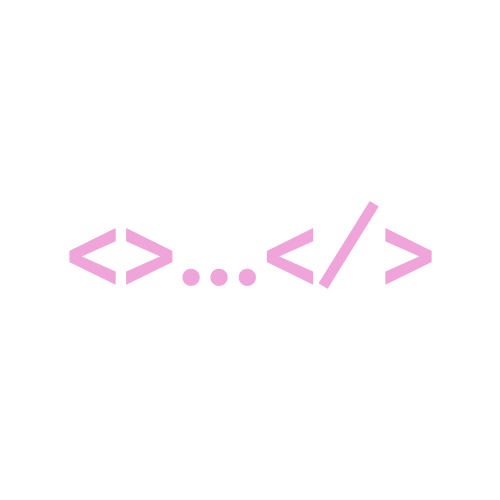

# My personal portfolio

Personal Website with my latest development projects.



## Install

- Install all dependencies described in package.json:

```
$ npm install
```
## Run

```
$ npm start
```

- Open [http://localhost:3000](http://localhost:3000) with your browser to see the result.

## Links

[Live Web](https://teresamartinezfernandez.github.io/my-personal-portfolio/)

## Built with

- [create-react-app](https://reactjs.org/)

## Created by

- [**Teresa Martinez Fernandez**](https://github.com/TeresaMartinezFernandez)
- [LinkedIn](https://www.linkedin.com/in/teresamarfer/)
